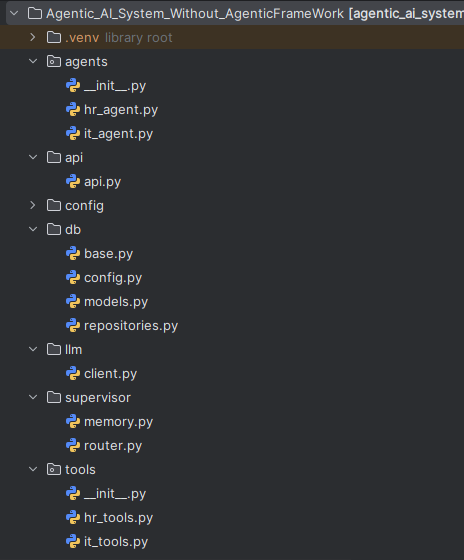
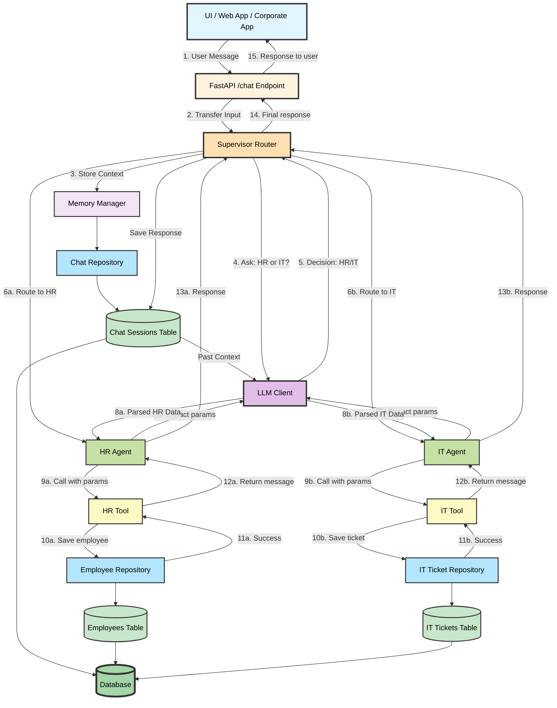
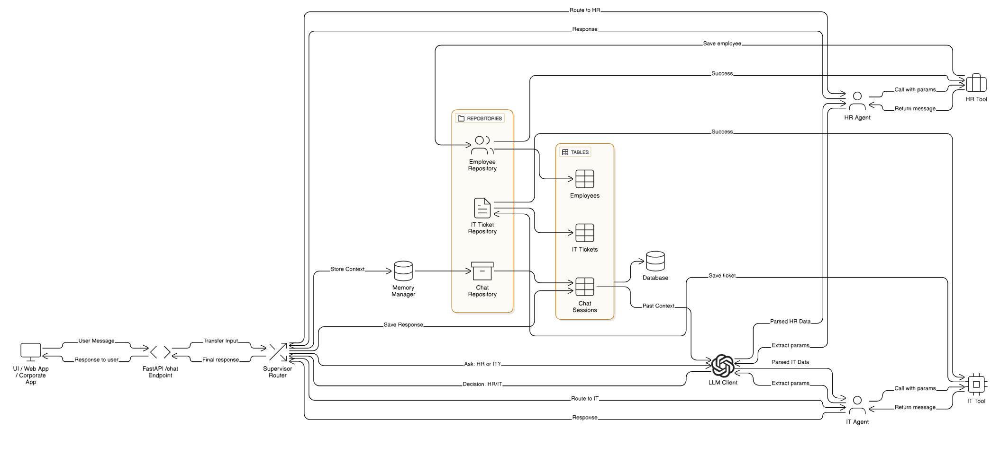

# Agentic AI System — Conceptual & Technical Documentation

> **Purpose of this document**  
This document explains **what we built, why we built it, how each part works, and how everything connects**, without focusing on Python syntax.  
It is written so that **AI/ML engineers, backend engineers, and frontend teams** can all understand the system clearly.

---

## 1. High-Level Understanding (Conceptual)

This project is a **production-ready Agentic AI backend**, designed to work with:
- Enterprise UI (web / mobile / internal tools)
- Logged-in users (HR, IT, Admin, etc.)
- Persistent database storage
- Natural language input (not forms or buttons)

### What this system does
- Accepts **free-text user messages**
- Uses **LLM reasoning** to understand intent
- Delegates work to **domain-specific agents**
- Saves results to a **database**
- Returns **human-readable responses** suitable for chat UI

This is **not a demo**.  
This is the same architectural pattern used in real enterprise AI systems.

---

## 2. Why LLM is Used (and where it is NOT used)

### LLM is used for:
- Understanding natural language
- Extracting structured information from text
- Deciding *what action* to take inside a domain
- Handling language variations (not fixed keywords)

### LLM is NOT used for:
- Authentication
- Authorization
- UI role detection
- Database logic
- Business rule enforcement

> **Important principle**  
LLM replaces *if/else on language*, not *system logic*.

---

## 3. Folder-Level Structure  Overview

````
agentic_ai_system/
│
├── api/ → API entry point (what UI talks to)
├── agents/ → Domain intelligence (HR, IT)
├── supervisor/ → Optional routing intelligence
├── tools/ → Business actions (DB writes)
├── db/ → Database models & persistence
├── llm/ → LLM client (Groq)
├── config/ → Environment & settings

````


---
## Logical Flow 

---


---

## Agentic AI System Architecture 




## 4. `tools/` Folder — Business Actions Layer

### Why this folder exists
This folder contains **what actually happens in the system**, not AI reasoning.

### Files inside
- `hr_tools.py`
- `it_tools.py`

### Conceptual structure of each tool file
Each tool file has **two logical blocks**:

#### 1️⃣ Import block
- Imports SQLAlchemy session
- Imports database save functions from `repositories.py`

Purpose:
> Connect tool logic to database persistence

#### 2️⃣ Function block
- Receives **already-extracted parameters**
- Calls repository functions
- Returns **human-readable output string**

Example (conceptual):
- HR tool receives: `name`, `role`, `emp_id`
- IT tool receives: `issue`, `priority`, `ticket_id`

Tools **do not decide anything** — they only **execute**.

---

## 5. `db/` Folder — Persistence Layer

This folder ensures **nothing is lost when the server restarts**.

### Files inside
- `base.py`
- `models.py`
- `repositories.py`

---

### 5.1 `base.py` — Foundation

- Defines the **Base class**
- Creates database engine
- Manages session lifecycle

> All database models inherit from `Base`

---

### 5.2 `models.py` — Data Structure Definitions

This file defines **what data looks like** in the database.

#### Classes inside
- `Employee`
- `ITTicket`
- `ChatSession`

Each class:
- Is a **table**
- Inherits from `Base`
- Defines columns (id, name, role, timestamps, etc.)

> These are **schemas**, not logic.

---

### 5.3 `repositories.py` — Database Operations

This file contains **pure data access logic**.

Functions include:
- `save_employee`
- `save_it_ticket`
- `save_chat_message`
- `get_last_messages`

Purpose:
> Centralize all DB read/write operations

Why this matters:
- Tools don’t talk to DB directly
- Agents don’t talk to DB at all
- Easy to switch DB later (SQLite → Postgres)

---

## 6. `agents/` Folder — Domain Intelligence

### Why agents exist
Agents are **thinking layers**, not executors.

They:
- Talk to LLM
- Understand user intent
- Extract structured values
- Call tools with clean parameters

---

### HR Agent (`hr_agent.py`)
Responsibilities:
- Understand onboarding-related messages
- Extract:
  - Employee name
  - Role
- Generate employee ID
- Call HR tool

It **does not**:
- Talk to database
- Know SQL
- Store data itself

---

### IT Agent (`it_agent.py`)
Responsibilities:
- Understand IT-related issues
- Extract:
  - Issue description
  - Priority
- Generate ticket ID
- Call IT tool

Same design philosophy as HR agent.

---

## 7. `supervisor/` Folder — Routing Intelligence (Optional but Powerful)

### Why supervisor exists
Supervisor decides **which agent should handle the message** when:
- UI is generic (chatbot, Slack, WhatsApp)
- No explicit department info is available

### What it does
- Looks at conversation context
- Uses LLM to decide:
  - HR
  - IT

### Important note
In enterprise UI:
- This can be **bypassed**
- Routing can be done using logged-in user role

The supervisor is **future-proofing**, not mandatory.

---

## 8. `llm/` Folder — LLM Integration Layer

### Purpose
Isolate all LLM logic into **one place**.

### `client.py`
- Wraps Groq SDK
- Handles:
  - API key
  - Model selection
  - Prompt sending
  - Response extraction

Why this matters:
- Easy to swap Groq → OpenAI → Bedrock
- Agents don’t care which LLM is used

---

## 9. `api/` Folder — Entry Point for UI

### `api.py`
This is the **only file UI interacts with**.

Responsibilities:
- Accept HTTP requests
- Read headers (user ID, role)
- Manage DB session lifecycle
- Call supervisor or direct agent
- Return response in chat-friendly format

Important behavior:
- Stateless
- No UI assumptions
- No frontend logic

---

## 10. Authentication & Authorization (Conceptual)

- Authentication (login) is handled **outside** this system
- UI sends:
  - `X-USER-ID`
  - `X-USER-ROLE`

This system:
- Reads headers
- Uses role as context
- Does not manage login itself

This is **enterprise standard**.

---

## 11. End-to-End Flow (Plain English)

1. User types message in UI
2. UI sends message + headers to `/chat`
3. API opens DB session
4. Supervisor (or role-based routing) selects agent
5. Agent asks LLM to extract intent
6. Agent calls tool with clean parameters
7. Tool saves data via repository
8. DB persists data
9. API returns readable response
10. UI displays response in chat

---

## 12. Why This Is Production-Ready

- Persistent storage
- Stateless API
- Clear separation of concerns
- Replaceable LLM
- Replaceable DB
- UI-agnostic
- Cloud-deployable

This is **not a toy architecture**.

---

## 13. Common Doubts & Clarifications

### ❓ Why use LLM if UI already knows HR/IT?
LLM is needed for **language understanding**, not routing.

---

### ❓ Can routing be done without supervisor?
Yes. Supervisor is optional and configurable.

---

### ❓ Can this scale to many agents?
Yes. Add agents without changing API.

---

### ❓ Can this connect to real frontend?
Yes. API contract is stable.

---

### ❓ Is this enterprise-grade?
Yes. This is how modern AI backends are designed.

---

## 14. Final Note

This system is intentionally:
- Simple in code
- Strong in architecture
- Flexible for future upgrades

You can now:
- Deploy it
- Hand it to frontend team
- Extend it with frameworks later

**This foundation will not break.**

---  
**End of Documentation**

